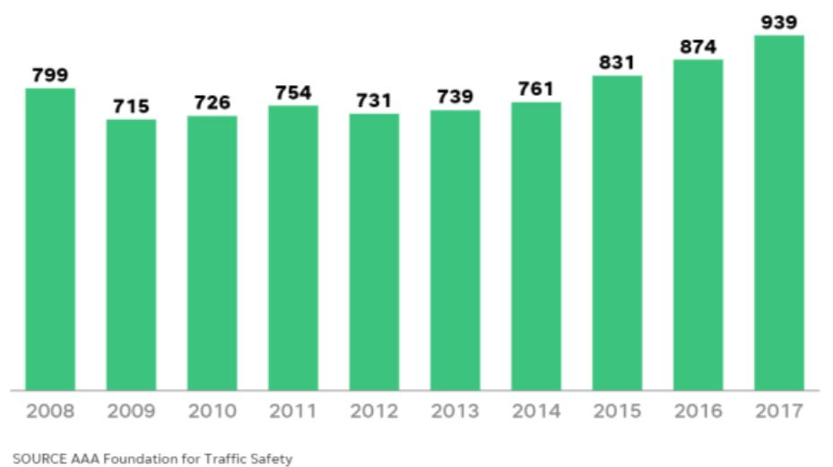
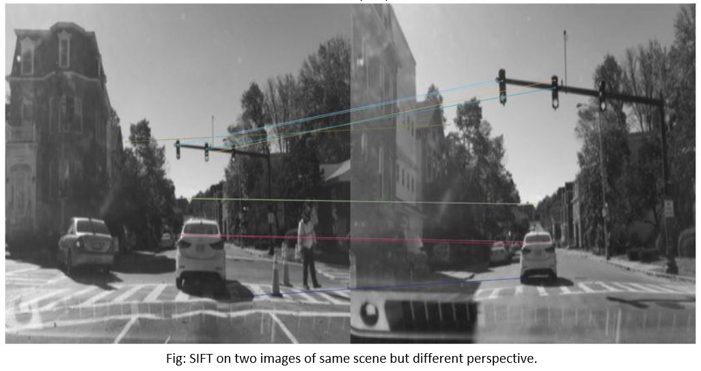
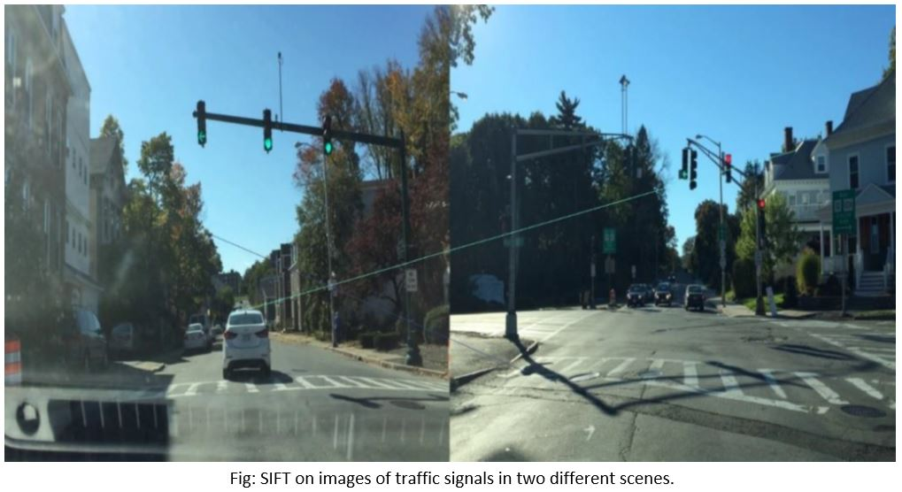
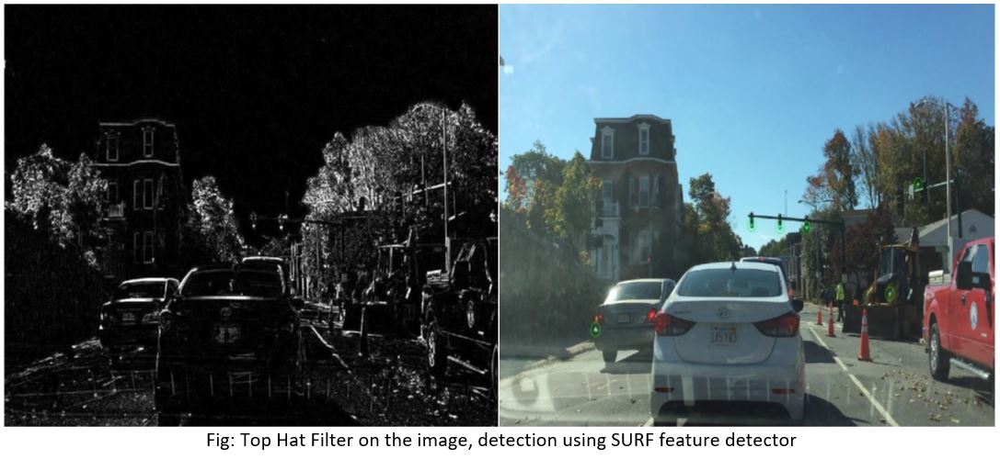
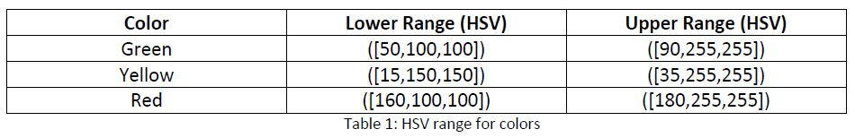
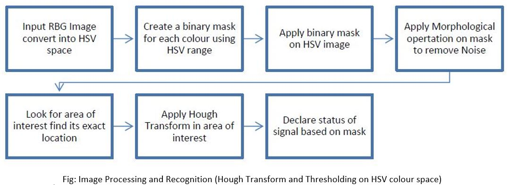
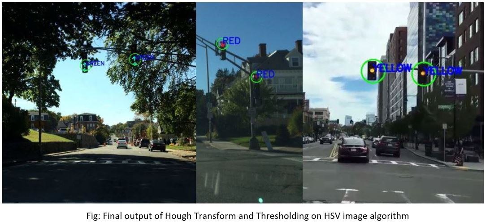
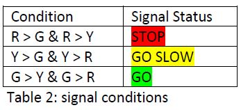
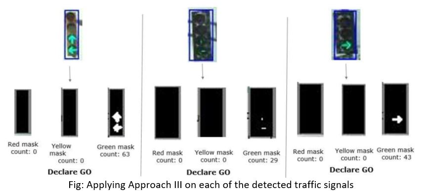

# Detection-and-Recognition-of-Traffic-Signals

## Overview

### Introduction
Nowadays, traffic signals detection system has an immediate use to avoid accidents. From an online survey sourced by AAA foundation for traffic safety, deaths from drivers running red lights in America has reached more than 30% in 2017 from 2009 as shown in fig below.

Our objective is to implement an object detecting algorithm that detects traffic signals accurately under different environmental conditions like illumination, motion, etc. In this paper, we used classical computer vision techniques like Hough, SIFT and Top hat filter to detect the traffic lights. We also used YOLOv3 for accurate detection and made a comparative analysis with other methods implemented. The results of this project are stated with different cases that defines both the prospects and challenges of our algorithm implementation.
  
  ## Implementation 
  We have used OpenCV to implement our project along with libraries such as numpy, pandas, matplotlib, etc. will be used based on our project requirements. The implementation workflow will be as follows:

**1. Scale Invariant Feature Transform (SIFT)**: 

Scale Invariant Feature Transform (SIFT) is a technique used in computer vision to detect features in an image. Each feature vector is a vector of 128 numbers with stores overall magnitude and direction information of gradient at that key point, and thus can be referred as ‘fingerprint’ of a key point. In order to match key points in two images, the algorithm compares each feature vector from the new image with feature vectors of the test image and selects the ‘best-match’ based on minimum Euclidean distance between the two feature vectors. For detection of traffic signal, this SIFT feature detection algorithm is applied on two images of traffic signals of same scenario taken from two different perspectives

The SIFT algorithm is invariant to scale but not to changes in perspective, thus when two images of same scene are compared from same perspective, the accuracy of the algorithm improved as compared to images from different perspective

Change in perspective or change in the scene, the algorithm performs poor to match features with accuracy and robustness. So, we added Top Hat Filter with SIFT and SURF feature detector.

**2.	Top Hat Filter with SURF feature detector:** 

Top hat filter is a mathematical morphological operation that extracts tiny elements and details from images. There are two types of Top Hat Filters:

**•	White Top Hat Transform:**: The White Top Hat transform is obtained by performing the Opening Operation on an image in grayscale and subtracting the result of this operation from the input image in grayscale.

𝐿𝑒𝑡 𝐴: 𝐸 → 𝑅 𝑏𝑒 𝑎 𝑔𝑟𝑎𝑦𝑠𝑐𝑎𝑙𝑒 𝑖𝑚𝑎𝑔𝑒, 𝑚𝑎𝑝𝑝𝑖𝑛𝑔 𝑓𝑟𝑜𝑚 𝐸𝑢𝑐𝑙𝑖𝑑𝑎𝑛 𝑠𝑝𝑎𝑐𝑒 𝑡𝑜 𝑎 𝑟𝑒𝑎𝑙 𝑙𝑖𝑛𝑒

The White Top Hat filter is then given by:

<b>𝐹𝑤 = 𝐴 − (𝐴 𝜊 𝐵)</b>

It is mathematically represented by:

  <b>(𝐴 ⊖ 𝐵) ⊕ 𝐵</b>

**•	Black Top Hat Filter:** The black top hat filter is given by closing an Image first and then subtracting the input image from the results of the closing operation.

For the purpose of this project, we have used white top hat filter algorithm and the SURF detector. SURF makes use of the Hessian Matrix for selecting the location and scale.

**3.	Hough Transform and Thresholding on HSV Colour space:** 

Using this HSV image our next goal is to define HSV range for red, green and yellow so we can segment our image based on three different colors. HSV range for three different colors used are as follows:

Next step is to apply this colour ranges on an HSV image and create a binary mask for red, yellow and green. Another object which is not traffic light can also lie in three HSV colour range. So, to avoid this noisy outlier we used image morphological operations like opening followed by dilation. An opening is defined as an erosion followed by a dilation using the same structuring element for both operations.

This algorithm is invariant to illuminous and performs well in most of the case and was able to detect the traffic signal successfully. Following Image shows three different signal light and its detection using this algorithm.

**4.	YOLOv3 (You Only Look Once):**

We used deep learning network architecture like YOLOv3 for real time object detection. It is a feature learning-based network that adopts 75 convolutional layers as its most powerful tool. Model weights and config file for the model was pre-trained. Pre-trained model can detect up to 80 different objects (e.g. Traffic signal, car, chair, etc.). We modified the model to just detect traffic signal from 80 different classes. We set a threshold where we specify that bounding box with probability or confidence less than 75% is discarded. By applying the algorithm discussed in Approach 3, we obtain binary mask images for each colour of the signal (red, yellow and green). For each of the detected signals in each binary mask images (for R, Y & G) we compute the total number of white pixels which serve as an important variable in our decision rule.

Decision rule:

R= # of white pixels in red mask;
G= # of white pixels in green mask;
Y= # of white pixels in yellow mask.

The Yolov3 algorithm was even tested to run on real time by applying it on the video which is a travel vlog on the routes of Downton Boston. The results of this performance can seen from the short video below.

[`Demo Video 1`]  [`Demo Video 2`]  

[`Dataset`]

[`Demo Video 1`]: https://www.youtube.com/watch?v=PsYKZ-kU1rA
[`Demo Video 2`]: https://www.youtube.com/watch?v=6thHwfyPkGg
[`Dataset`]: http://computing.wpi.edu/dataset.html

## Results: 
**1. SIFT**: As a result of the analysis, it was found that SIFT feature detection algorithm
was able to detect features in two images when the two images are from scene and almost similar
perspectives. But when there is a change in scenario or perspective, the performance of the algorithm deteriorates, and it loses it accuracy.

**2. Top Hat Filter with SURF:**
Upon applying the Top Filter along with the SURF Algorithm, while the traffic signals were being
detected, there were multiple outliers. The methodology would detect the brightest spot on the
image and would mark it as traffic signal. However, if another object of similar or greater
intensity was present in the image; it would also be marked as a traffic signal which gave rise to
inaccuracy in the technique. Moreover, with each image having different parameters such as
distance of the signal from the camera, a single code can’t detect and mark signals in all images
as the kernel required for each image would be different and so the methodology is not robust
and a different technique was needed for higher accuracy and robustness.

**3. Hough Transform and thresholding on colour space:**
From the analysis, it was found that implementation of this algorithm was able to detect a traffic light and classify it into red, green or yellow properly. But this algorithm has certain inherent limitations like it can easily get confused if it detects a circular object in the image which has the same HSV colour range as that of red, yellow or green traffic light.

**4. YOLOv3:**
The YOLOv3 algorithm was able to detect the traffic signals with accuracy in robustness. In addition to this, it was able to detect signals even under different lighting conditions (day and night) and even in real time. The inherent drawback of this algorithm is the computation time. Due to its computational complexity, the computation drops to as low as 7 fps.

## Conclusions:
As analysed in the ‘Results’, each of the four methods implemented have their own advantages and disadvantages associated with them. Out of the four, YOLOv3 performed the best in terms of accuracy and robustness. It was even able to detect traffic signals under different lighting conditions and in real time. Once detected a traffic signal, it was even able to detect the colour of the light of traffic light. Thus, in terms of performance, it can be sufficiently concluded that the YOLOv3 algorithm would be the best to be implemented, if need be, on an autonomous vehicle. Also, the current issues faced in implementing this algorithm can be further reduced by implementing it on sophisticated GPUs with current embedded computing boards such as NVIDIA Jetson.

